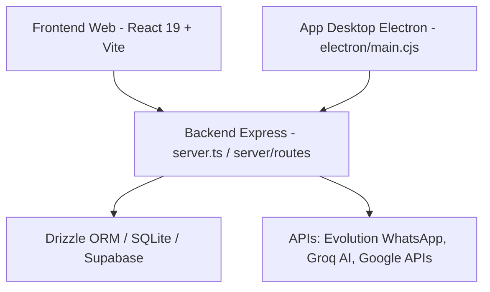

# MDR Informática e Celulares — Visão Geral do CRM

Esta skill documenta o ecossistema e a arquitetura do **CRM MDR**, cobrindo o Backend (Express + Drizzle ORM), Banco de Dados (SQLite local / PostgreSQL Supabase), Frontend (React 19 + TailwindCSS) e App Desktop (Electron).

---

## 🏗️ 1. Arquitetura do Sistema

- **Stack Base**:
  - **Frontend**: React 19, Vite, TailwindCSS v4, Zustand, Lucide React, Recharts.
  - **Backend**: Node.js, Express, Drizzle ORM, Better-SQLite3 / Supabase (PostgreSQL).
  - **Desktop**: Electron com empacotamento NSIS.

---

## 🗄️ 2. Módulo de Banco de Dados (`server/db/` & SQLs)

O banco de dados gerencia a operação de vendas, crediário próprio, controle de estoque (aparelhos/IMEI), ordens de serviço (manutenção) e investidores/SCP.

### Principais Entidades e Tabelas
1. **Unidades/Lojas (`stores`)**: Lojas físicas com configurações individuais e integração WhatsApp (Evolution API).
2. **Usuários/Perfis (`profiles`)**: Vendedores, administradores, técnicos e investidores.
3. **Clientes (`customers`)**: Cadastro de clientes com contatos de referência, contatos de responsáveis e status financeiro.
4. **Dispositivos/Estoque (`devices`)**: Estoque de aparelhos por IMEI/Serial, status (`available`, `sold`, `in_repair`), preço de custo e venda.
5. **Vendas (`sales`)**: Registro de vendas presenciais/online com entrada (`down_payment`), taxas, juros e método (`crediario`, `vista`, `card`).
6. **Parcelas/Crediário (`installments`)**: Cronograma de vencimentos, controle de inadimplência, pagamentos parciais e juros/multas.
7. **Ordens de Serviço (`service_orders`)**: Gestão de reparos técnicos de celulares e computadores com peças e status Kanban.
8. **Investidores / SCP (`scp_investors`, `scp_contracts`, `scp_payouts`)**: Gestão de contas de participação e distribuição de dividendos sobre a carteira.
9. **Caixa e Finanças (`cashier_sessions`, `financial_transactions`)**: Fechamento diário de caixa por loja, sangrias, suprimentos e DRE.

---

## ⚙️ 3. Backend e Rotas (`server/routes/`)

- `sales.ts`: Processamento de vendas, baixa de estoque por IMEI e geração de parcelas.
- `customers.ts`: CRUD de clientes, consulta de limite e histórico financeiro.
- `finance.ts` & `billing.ts`: Cobranças, recebimentos de parcelas, emissão de carnês e réguas de cobrança.
- `cashier.ts`: Abertura, movimentação e fechamento de caixa diário.
- `service_orders.ts`: Fluxo completo de ordens de serviço e laudo técnico.
- `scp.ts` & `scp_payout_trigger.ts`: Gestão de rendimentos e repasse para investidores.
- `evolution.ts` & `webhooks.ts`: Automação de envio de mensagens e cobranças via WhatsApp.
- `ai.ts`: Assistente com Groq SDK para suporte em vendas e diagnósticos.

---

## 🎨 4. Frontend (`src/`)

- `src/pages/`:
  - `Sales.tsx` / `NewSale.tsx`: Balcão de vendas e emissão de contratos/carnês.
  - `Customers.tsx`: Gestão de clientes e análise de crédito.
  - `Financial.tsx` / `Cashier.tsx`: Controle de caixa, inadimplência e DRE.
  - `ServiceOrders.tsx`: Painel Kanban de manutenção.
  - `SCP.tsx`: Painel de investidores.
- `src/components/sales/ContractPrint.tsx`: Impressão de contratos de venda e carnês de pagamento em formato A4/térmico.

---

## ⚡ 5. Boas Práticas e Regras do Projeto
1. **Otimização de Leitura**: O arquivo `.geminiignore` previne a leitura de logs, dbs locais e pastas `dist/` ou `node_modules/`.
2. **Persistência Híbrida**: O sistema suporta execução local via SQLite (Electron/Offline) e nuvem via Supabase.
3. **Consistência de Estoque**: Dispositivos com IMEI devem ter transação atômica ao realizar vendas ou dar entrada na assistência técnica.
