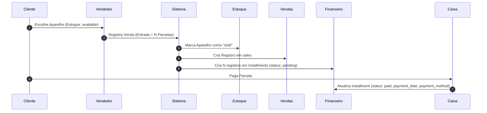

# MDR CRM — Estrutura e Schemas do Banco de Dados

Esta skill detalha a modelagem do banco de dados do CRM MDR.

---

## 🗄️ Tabela de Entidades Principais

| Tabela | Função / Propósito | Chave Primária | Relações Chave |
| :--- | :--- | :--- | :--- |
| `stores` | Unidades/Lojas do grupo | `UUID` / `INTEGER` | Possui vários `profiles`, `sales`, `devices` |
| `profiles` | Usuários do sistema (Vendedores, Admin, Técnicos) | `UUID` / `INTEGER` | Pertence a `stores` |
| `customers` | Clientes finais da loja | `UUID` / `INTEGER` | Possui várias `sales`, `service_orders` |
| `devices` | Estoque de aparelhos por IMEI/Serial | `UUID` / `INTEGER` | Vinculado a `stores` e `sales` |
| `sales` | Vendas registradas no balcão | `UUID` / `INTEGER` | Pertence a `customers`, `profiles`, `devices` |
| `installments` | Carnê / Parcelamento de Crediário | `UUID` / `INTEGER` | Pertence a `sales` |
| `service_orders` | Ordens de serviço para manutenção de aparelhos | `UUID` / `INTEGER` | Pertence a `customers`, `stores` |
| `cashier_sessions` | Abertura e fechamento de caixa | `UUID` / `INTEGER` | Vinculado a `stores`, `profiles` |
| `scp_investors` | Investidores da Sociedade em Conta de Participação | `UUID` / `INTEGER` | Possui contratos `scp_contracts` e dividendos `scp_payouts` |

---

## 🔄 Fluxo Financeiro (Crediário Próprio)

