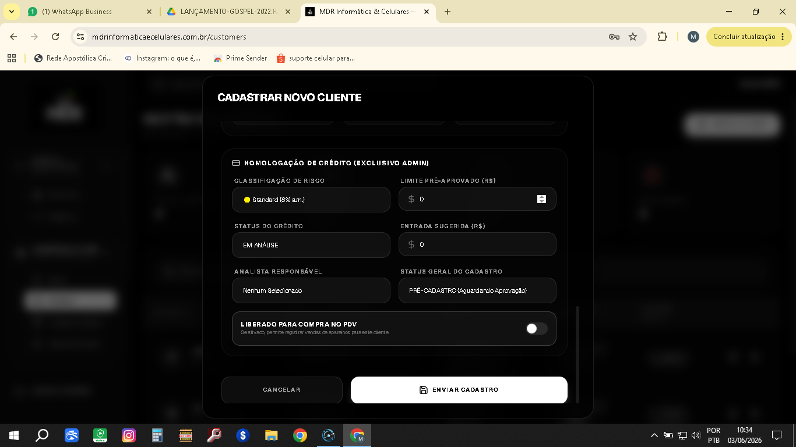
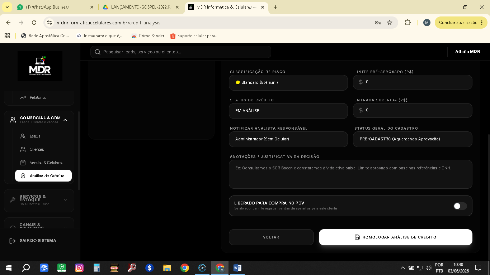
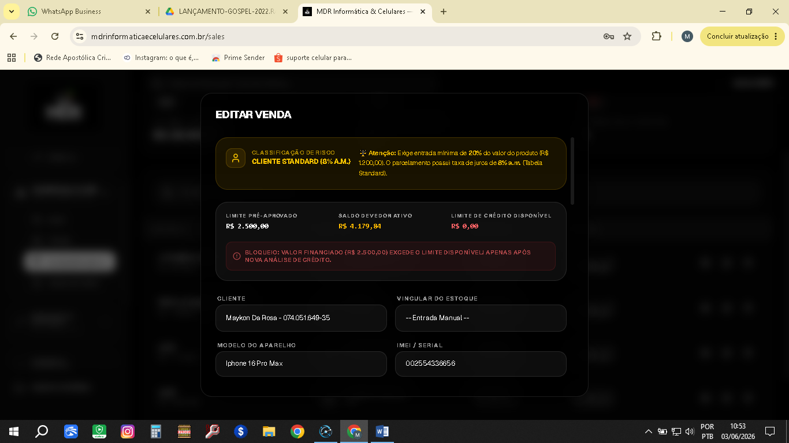
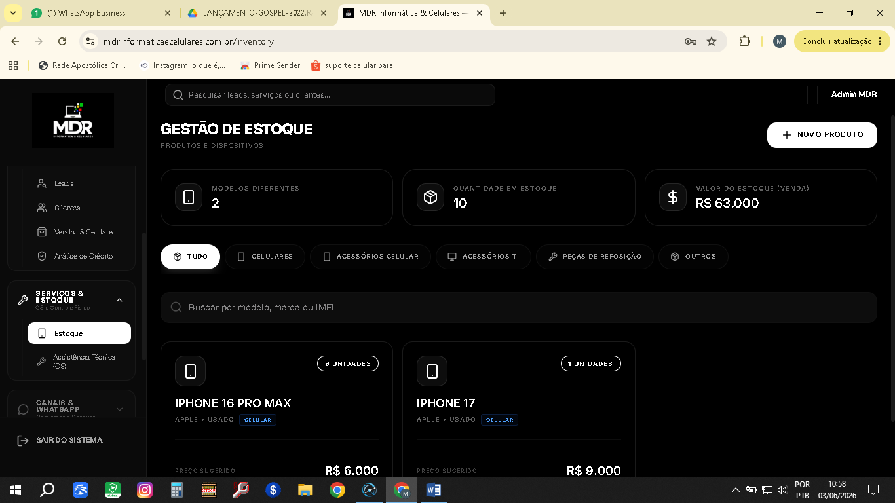
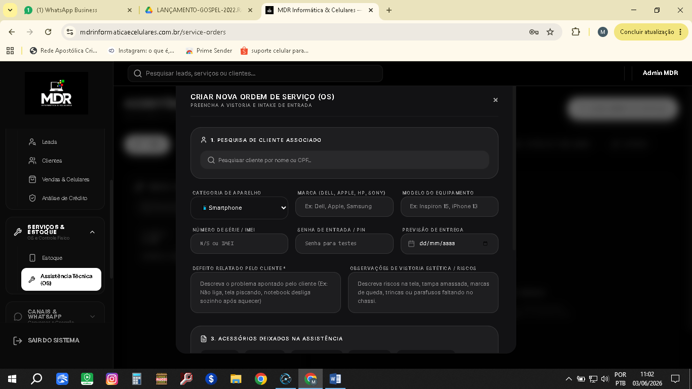

{width="5.905555555555556in"
height="3.3201388888888888in"}

-   No cadastro do cliente não pode aparecer esta parte acima. So enviar
    o cadastro

-   Falta o campo de enviar o aparelho que o cliente está a procura (pre
    venda) quantos precisa de credito. (Ex: uma simulação sujeita a
    aprovação - valor de entrada, valor médio bom para a prestação) .

{width="5.905555555555556in"
height="3.3201388888888888in"}

-   Aqui na analise de credito deixa sempre o botão liberado compra pdv
    (sempre como não autorizado) so mudar se o analista achar
    necessário. Para não ter eventuais problemas.

-   Tem duas opções que acredito ser uma so é necessária (**Status do
    Crédito e Status Geral do Cadastro)**

{width="5.905555555555556in"
height="3.3201388888888888in"}

-   Na hora da venda o sistema permitir fechar a venda passando do
    limite dado pela financeiro. (não pode aceitar sem analise
    novamente)

-   Por isso a melhor forma e fazer um campo de pre venda para não ter
    este tipo de problema.

-   Forma de pagtos (avista) pois ai o sistema permitir vender para
    todo, quando avista somente nota de venda.

Vou mandar junto um contrato para nos utilizar como padrão.

\- nota de venda e contrato não estão imprimindo!

{width="5.905555555555556in"
height="3.3201388888888888in"}

-   Na parte do estoque ele não esta baixando os produtos quando vendido

{width="5.905555555555556in"
height="3.3201388888888888in"}

-   Duas vias e configurar para impressora de cumpom fiscal.
